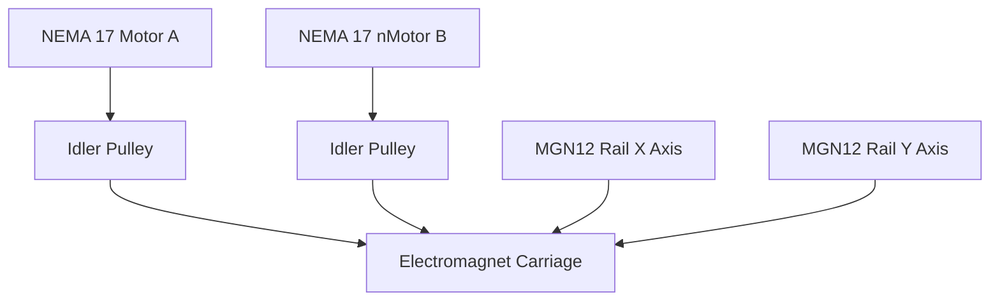
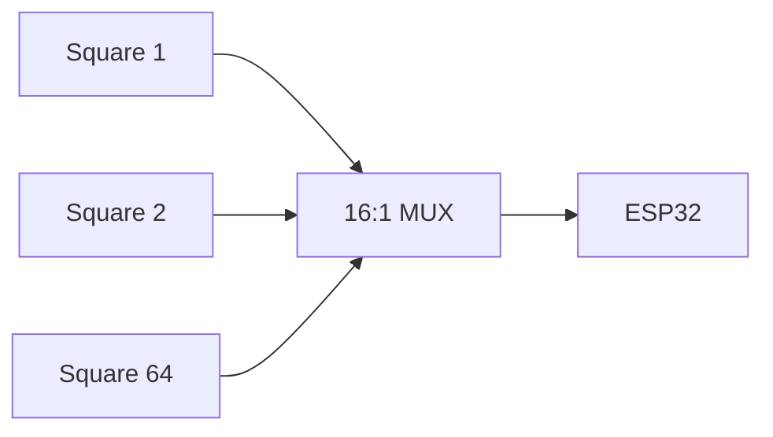
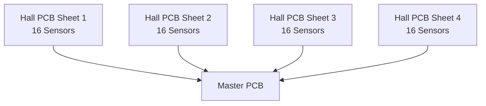

# Imperium
### An Autonomous, Sensor-Driven Chessboard with Electromagnetic Piece Control

**Author:** Aarav Singhania  
---

## Abstract

**Imperium** is a fully autonomous chessboard that detects and moves pieces using a precision electromagnetic gantry, per-square Hall-effect sensing, and CNC-style motion control. The system integrates custom mechanical design, multi-PCB electronics, and firmware-level motion planning to deliver seamless, repeatable gameplay without manual calibration.

---

## System Overview

```mermaid
flowchart LR
    Pieces[Chess Pieces\n(Magnets)]
    Sensors[Hall Sensor Matrix\n(64 Squares)]
    Mux[Multiplexers\n(16:1)]
    MCU[ESP32\nMaster Controller]
    Drivers[TMC2209\nMotor Drivers]
    Motors[Stepper Motors\n(T-Bot Gantry)]
    Magnet[Electromagnet]

    Pieces --> Sensors
    Sensors --> Mux
    Mux --> MCU
    MCU --> Drivers
    Drivers --> Motors
    MCU --> Magnet
```


## Project Media

### Completed System

<p align="center">
  
</p>

<p align="center">
  <em>Figure 2: Fully assembled Imperium chessboard</em>
</p>

### Videos
- 🎥 demonstration video: *(link)*


---

## Hardware Architecture

### Mechanical Subsystem

<p align="center">
  
</p>

<p align="center">
  <em>Figure 3: T-Bot gantry layout and belt routing</em>
</p>

**Gantry Design**
- Type: **T-Bot (CoreXY derivative)**
- Motors: 2× NEMA 17
- Linear motion: 2× MGN12 rails (450 mm)
- Drive: GT2 belts & pulleys
- End effector: Electromagnet (custom mount)

**Design Rationale**
- Compact footprint compared to CoreXY  
- Sufficient precision for chess (no micron-level requirement)  
- Reduced part count and cost  

---

### Electromagnet Assembly

<p align="center">
  
</p>

<p align="center">
  <em>Figure 4: Electromagnet carriage mounted to gantry</em>
</p>

The electromagnet is mounted beneath the board and selectively energized to move pieces while remaining disengaged during traversal.

---

## Sensing Architecture

### Hall Sensor Matrix


<p align="center">
  <em>Figure 5: 64-square Hall-effect sensor grid</em>
</p>

- Sensors: **KTH-1601 (46 Gs threshold)**
- 1 sensor per square (64 total)
- Mounted beneath ~3 mm acrylic

**Why Hall Sensors**
- Instantaneous response  
- No ghosting (unlike reed switches)  
- Reliable removal detection  

---

### PCB Sheet Layout

<p align="center">
  
</p>

<p align="center">
  <em>Figure 6: Hall sensor PCB sheet (100 mm × 400 mm)</em>
</p>

Each PCB sheet contains:
- 16 Hall sensors  
- 1× 16:1 multiplexer  
- Local decoupling capacitors  
- Ribbon cable interface  

Total sheets: **4**

---

## Control Electronics

### Master Control Board

<p align="center">
  
</p>

<p align="center">
  <em>Figure 7: Master PCB functional block diagram</em>
</p>

**Core Components**
- MCU: **ESP32**
- Motor drivers: **2× TMC2209 (UART)**
- Power:
  - 12 V rail (motors + electromagnet)
  - Buck converter → 3.3 V logic
- Electromagnet switching via transistor

All schematics and footprints were custom-designed in KiCad.

---

### UART Motor Control
Chess pieces are moved exclusively along square edges rather than diagonals. This design choice:

Prevents collisions with stationary pieces

Simplifies motion planning

Ensures consistent and predictable movement paths

The gantry executes all moves as a sequence of orthogonal segments.

UART enables:
- Sensorless homing  
- Stall detection  
- Current tuning  
- Advanced diagnostics  

---

## Motion Control & Software Pipeline

<p align="center">
  
</p>

<p align="center">
  <em>Figure 9: End-to-end software and motion pipeline</em>
</p>

### Control Flow

1. **Board State Detection**  
   Hall sensor matrix scans current piece positions.

2. **Move Translation**  
   Chess moves converted into constrained paths.

3. **G-Code Generation**  
   Custom G-code enforces non-diagonal movement.

4. **Execution**  
   G-code executed by **FluidNC** on ESP32.

---


## Bill of Materials (BOM)

<p align="center">
  
</p>

📎 **Full BOM:**  
https://docs.google.com/spreadsheets/d/1yp7t6AiXMwJCAfVlhCX7udocGjks9lOOFWkv4rPJByo/edit

---

## Results

- Reliable autonomous gameplay  
- Accurate per-square detection  
- Consistent homing and positioning  
- No recalibration required between games  

---

## Future Work

- Chess engine integration  
- Companion UI / mobile app  
- Faster traversal paths  
- Noise reduction  
- Fully enclosed consumer-ready housing  

---

## References

- CoreXY reference — https://corexy.com  
- Gantry design pitfalls — https://drmrehorst.blogspot.com  


---

**CAD**


**PCB**


  


